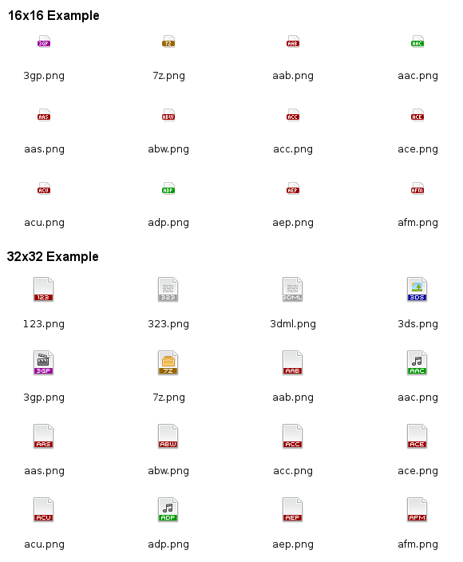

File Icon Generator
===================

This class can build pixel-perfect file type icons based on a extension name
and its associated mime type.

Icons are build based on a template file on which then a colored label with
the extension is printed. This makes it easy to create a consistent look in
your application without the problem of missing the icon for a certain file
type.

Currently 16x16 and 32x32 images can be generated.



Usage
-----

See createall.php for building all icons at once, otherwise just refer to the
source code comments. It's relatively straight forward.

MIME matching
-------------

Color and template files are first matched against a ```extension-<ext>```
entry. If that is not found the mime type is matched.

For matching mime types in color and template setup the mime type of an extension
is broken up parts at the charcters ```/```, ```.``` and ```-``` and connected
with a ```-``` again.

Partial matches are then tried per segment. Example:

```application/vnd.openxmlformats-officedocument.wordprocessingml.document``` becomes
```application-vnd-openxmlformats-officedocument-wordprocessingml-document```. It
could be matched with ```application-vnd-openxmlformats``` or ```application```. The
longest match wins. Note: ```wordprocessingml``` would not match!

Todo
----

This can be improved, pull requests more than welcome!

* define more colors
* create more templates for common formats
* add more output sizes
* currently the same extension can be associated with multiple mime types
  (eg. .doc) this makes it hard to know for which mime type to configure,
  maybe provide a cleaned up mime.type file

